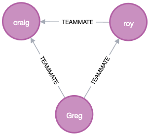

# ACCESSING DATA WITH NEO4J

## About
This is a simple application that connect with instance of neo4j. If you do not know [neo4j](https://neo4j.com/), access the website. 

It was created three person with relationship "teammate" and saved in database.

Each relationship is printed in console via log.

I used Docker to create a instance of neo4j.

When you run the application, it is possible to access the browser interface in http://localhost:7474. There you can see the gaph, like figure bellow:

