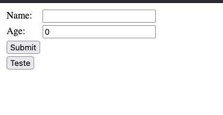

# VALIDATING FORM INPUT

## About
This is a simple application that validates the input of a form.

## How to use

To use this application clone this repository.

Run the command `mvn spring-boot:run`

Access in your browser the url: http://localhost:8080/

Now you can fill the form, just click on Submit button. Then you will redirect to `/results` page.

